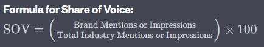

Share of Voice - SOV

In digital marketing, "share of voice" (SOV) is a metric that measures the proportion of online conversation and visibility a brand or product has in comparison to its competitors within a particular industry or market. It provides insights into how well a brand is performing in terms of online presence and awareness relative to others in the same space.

**Formula for Share of Voice:**

SOV = (Brand Mentions or Impressions/Total Industry Mentions or Impressions) × 100

**Explanation:**

- **Brand Mentions or Impressions:** The number of times a specific brand is mentioned online or the total impressions (views) its content receives.
- **Total Industry Mentions or Impressions:** The overall number of mentions or impressions within the industry or market where the brand operates.

**Key Points:**

- A higher share of voice indicates that a brand is dominating the online conversation within its industry.
- Monitoring share of voice helps brands understand their relative market position and competitiveness.
- Changes in share of voice over time can reflect shifts in brand awareness, marketing effectiveness, or changes in consumer sentiment.

Marketers use share of voice as a strategic tool to assess their brand's digital marketing performance and make informed decisions about resource allocation and campaign adjustments. It's a valuable metric for understanding the brand's visibility and influence within the digital landscape.